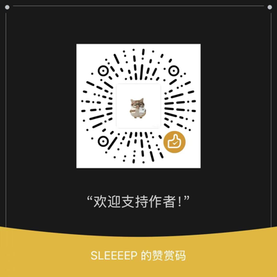

# 🔴 小红书下载器 · Xiaohongshu Downloader

> 下载小红书**图文原图**与**视频**，无需安装任何额外依赖（只需 `requests`）。
> 基于你浏览器登录态的 Cookie 解析页面数据，你**自己的账号能看的笔记**就能下。

```bash
python xhs_dl.py "https://www.xiaohongshu.com/explore/xxxxxxx"
```

## ✨ 功能特性

- ✅ **图文原图**：自动按顺序下载笔记全部原图（webp 原始图）
- ✅ **视频下载**：解析最高清视频流，保存为 MP4
- ✅ **短链支持**：自动解析 `xhslink.com` 分享短链
- ✅ **批量下载**：txt 每行一条链接，自动限速防封
- ✅ **元数据导出**：每篇笔记自动生成 `info.json`（标题/作者/原链接）
- ✅ 仅依赖 `requests`，Windows / macOS / Linux 通用

## 📦 安装

```bash
pip install requests
```

## 🚀 使用

### 第一步：获取你的 Cookie（约 30 秒）

小红书必须登录才能看图看视频，工具需要借用你**自己浏览器里的登录态**：

1. 用电脑浏览器（Chrome / Edge）打开 [xiaohongshu.com](https://www.xiaohongshu.com) 并**登录**
2. 按 `F12` 打开开发者工具 → 切到 **Network（网络）** 标签
3. 刷新页面，点任意一条请求（如 `explore`）→ **Headers** → 找到 **Request Headers** 里的 **Cookie** 一项
4. 右键 Cookie 的值 → **Copy value（复制值）**，粘贴到同目录下的 `cookie.txt` 文件保存

> 🔒 Cookie 只在你的本机使用，不会上传到任何服务器。退出登录后需重新复制。

### 单篇下载

```bash
python xhs_dl.py "https://www.xiaohongshu.com/explore/笔记ID"
# 或粘贴分享短链 / 带链接的整段文字
python xhs_dl.py "我在小红书看到了 https://xhslink.com/xxx 分享给你"
```

### 批量下载

```bash
# links.txt 每行一条链接
python xhs_dl.py links.txt -b
```

### 更多选项

```bash
python xhs_dl.py "<链接>" -o ./out        # 指定保存目录
python xhs_dl.py "<链接>" -c "a1=xxx; webId=yyy; ..."   # 直接粘贴 Cookie 字符串
```

## 📂 输出结构

```
downloads/
└── 作者昵称_笔记标题/
    ├── 01.webp / 02.webp …    (图文原图)
    └── video.mp4               (视频笔记)
    └── info.json               (标题/作者/原链接)
```

## ⚠️ 免责声明

本工具**仅用于学习研究及个人合理使用**（如备份自己收藏过的公开笔记）。

- 请遵守您所在国家/地区的法律法规及小红书社区规范，**尊重创作者版权**。
- 请勿将本工具用于任何**商业用途**、**侵权用途**，或批量抓取、再分发他人内容。
- 使用本工具产生的任何风险与法律责任由使用者自行承担。
- 如内容侵犯了您的合法权益，请联系我们，我们将第一时间移除相关链接与内容。

## ☕ 支持作者

如果这个工具帮到了你，欢迎扫码赞赏支持，让我有动力持续更新下去～



## 📄 License

[MIT](./LICENSE) © 2026 qgeng1465
